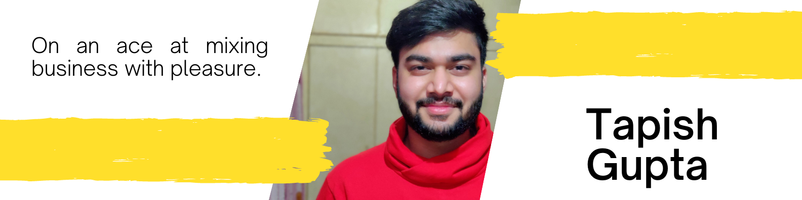

<!-- ### Hi there 👋 -->
<h1 align="center">Hey there, I'm Tapish </h1>
<h3 align="center">A Passionate Developer 👨‍💻 | Maker 🤹‍♂️ | Designer 👨‍🎨</h3>

<h3>📫 Lets Connect 🤝</h3>

 

<h3>🔭 Have a look at my work 👇</h3>

 

<h3>🌱 Have a look at my coding profiles 👇</h3>

 
 

<h2> ✔️ Tools and Techs Used by me 👇</h2>

 
 
 
 
 

<a href="https://github.com/tapixhx">
 
 
 
 

<h2>👯 Visitor's count :eyes:</h2>

<h2>⚡ Top langs :tongue:</h2>

<!--
**tapixhx/tapixhx** is a ✨ _special_ ✨ repository because its `README.md` (this file) appears on your GitHub profile.

Here are some ideas to get you started:

- 🔭 I’m currently working on ...
- 🌱 I’m currently learning ...
- 👯 I’m looking to collaborate on ...
- 🤔 I’m looking for help with ...
- 💬 Ask me about ...
- 📫 How to reach me: ...
- 😄 Pronouns: ...
- ⚡ Fun fact: ...
-->
